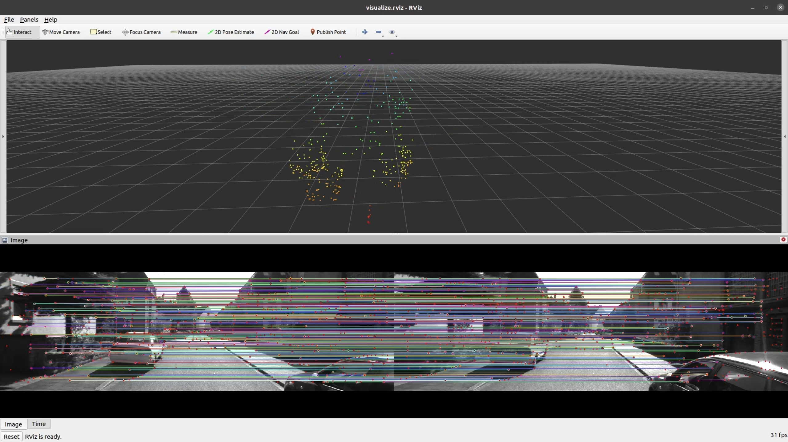

# super-vio

a simple vio project.

1. Front-End: SuperPoint and SuperGlue
2. Back-End: g2o

## Result

- 1. SuperPoint and SuperGlue, video on Bilibili: [click here](https://b23.tv/6eXpUU1)



## Build

```sh
mkdir -p catkin_ws/src
cd catkin_ws/src
git clone https://github.com/Nothand0212/super-vio.git
cd ..
catkin_make
```

## Run

```sh
roslaunch super_vio offline.launch
```
or
```sh
roslaunch super_vio run_kitti.launch
```


## Doing

- 1. Mapping with SuperPoint and SuperGlue

## History

- 2024-03-20:
  - 1. reconstruct project structure
- 2024-03-19:
  - 1. add Triangulate test
  - 2. add kitti dataset test
- 2024-03-11:
  - 1. change to ROS rviz visualization
  - 2. fix exactor bugs
- 2024-03-08:
  - 1. add offline_node
  - 2. change run logic
- 2024-03-05:
  - 1. add Frame, MapPoint
  - 2. add Triangulate 
  - 3. add cammera_runner test


## 参考

- [SuperPoint/LightGlue](https://github.com/cvg/LightGlue)
- [LightGlue-ONNX](https://github.com/fabio-sim/LightGlue-ONNX)
- [LightGlue-Onnx-cpp](https://github.com/Nothand0212/LightGlue-OnnxRunner-cpp): C++版本的LightGlue-ONNX运行器，支持Ubuntu
- [GTSAM](https://github.com/borglab/gtsam)

