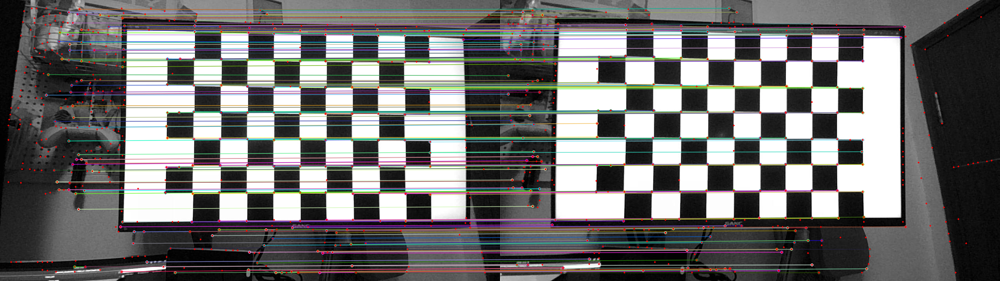

# ONNX Runtime Light Glue Example

A simple ONNX Runtime Light Glue example.

Test environment:
- Ubuntu 20.04
- ONNX Runtime onnxruntime-linux-x64-gpu-1.16.3 
- ONNX Runtime onnxruntime-linux-x64-1.16.3
- CUDA 11.7
- SPDLOG 1.13.0
- OpenCV 4.9.0

## Complie and Run

### Compile

- git clone https://github.com/Nothand0212/LightGlue-OnnxRunner-cpp.git
- cd LightGlue-OnnxRunner-cpp
- vim CMakeLists.txt # set(ONNXRUNTIME_ROOTDIR /home/lin/Projects/onnxruntime-linux-x64-gpu-1.16.3)change to your own onnx runtime path
- mkdir build && cd build
- cmake..
- make

### Run

- change `config/param.json` to your own path，include matcher_path、extractor_path、combiner_path、image_src_path and image_dst_path.

## Update Log

- 2024-01-28
    - 1. Added a single Extractor class;
- 2024-01-24
    - 1. Added support for non-end-to-end models (only supports super point and light glue)
- 2024-01-20
    - 1. Currently only supports the end-to-end model of super point and light glue

## Remaining BUG

- 2024-01-24
    - 1. When running in a GPU environment, some images (such as the project's data/left/21.png) will report an error `Non-zero status code returned while running MultiHeadAttention node. Name:'MultiHeadAttention_1' Status Message: packed QKV format is not implemented for current GPU. Please disable it in fusion options.`. But when running in a CPU environment, no error will be reported.

## References

- [LightGlue](https://github.com/cvg/LightGlue)
- [LightGlue-ONNX](https://github.com/fabio-sim/LightGlue-ONNX)
- [LightGlue-OnnxRunner](https://github.com/OroChippw/LightGlue-OnnxRunner)
- [ONNX Runtime](https://github.com/microsoft/onnxruntime)